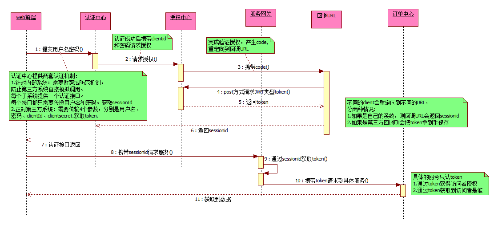
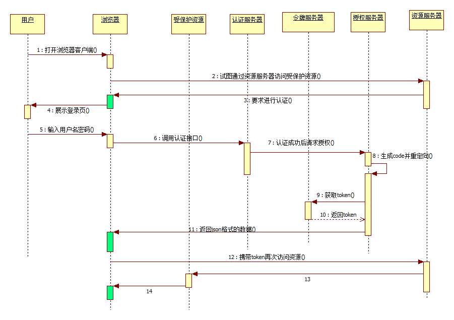

# Bright-Cloud
基于Spring Cloud Hoxton.SR7、Spring Cloud OAuth2 &amp; Spring Cloud Alibaba &amp; Element 微服务权限系统，开箱即用。
### Bright-Cloud 微服务权限系统


Bright-Cloud是一款使用Spring Cloud Hoxton.SR7、Spring Cloud OAuth2 & Spring Cloud Alibaba构建的低耦合权限管理系统，前端（Bright-Cloud-UI）采用vue-element-admin构建。该系统具有如下特点：

序号 | 特点
---|---
1 | 前后端分离架构，客户端和服务端纯Token交互； 
2 | 认证服务器与资源服务器分离，方便接入自己的微服务系统
3 | 服务之间调用采用OpenFeign
4 | 集成SpringBootAdmin，Skywalking APM
5 | 动态路由、网关限流、网关黑名单限制、网关日志
6 | 微服务Docker化，使用Docker Compose一键部署。
7 | 认证授权，数据权限，前后端参数校验，Starter开箱即用等
8 | 系统API接口文档
9 | OAuth2 4种模式+刷新令牌模式，提供5种获取系统令牌方式  
10| SaaS多租户模式                                                          

### 文档与教程

文档 | 地址
---|---
 | []()

### 系统架构

<table>
  <tr>
    <td align="center" style="background: #fff"><b>Bright-Cloud</b></td>
  </tr>
  <tr>
     <td align="center" style="background: #fff"></td>
   </tr>
   <tr>
      <td align="center" style="background: #fff"></td>
    </tr>
  <tr>
    <td align="center" style="background: #fff"></td>
  </tr>
   <tr>
    <td align="center" style="background: #fff"><b>Skywalking APM</b></td>
  </tr>
  <tr>
    <td align="center" style="background: #fff"></td>
  </tr>
</table>


### 项目地址

 平台  | Bright-Cloud（后端） |Bright-Cloud-UI（前端）
---|---|---
GitHub | [https://github.com/JacksonTu/Bright-Cloud](https://github.com/JacksonTu/Bright-Cloud) |[https://github.com/JacksonTu/Bright-Cloud-UI](https://github.com/JacksonTu/Bright-Cloud-UI)
Gitee  | [https://gitee.com/tumao2/Bright-Cloud](https://gitee.com/tumao2/Bright-Cloud) |[https://gitee.com/tumao2/Bright-Cloud-UI](https://gitee.com/tumao2/Bright-Cloud-UI)

### 演示地址

演示地址：[]()

演示环境账号密码：

账号 | 密码| 权限
---|---|---
test | 123456 | 注册账户，拥有查看权限

本地部署账号密码：

账号 | 密码| 权限
---|---|---
admin | 123456 |超级管理员，拥有所有增删改查权限
scott | 123456 | 注册账户，拥有查看，新增权限（新增用户除外） 
jackson | 123456 |系统监测员，负责整个系统监控模块

APM平台相关账号密码：

平台 | 账号| 密码
---|---|---
fast-admin | admin |123456

### 服务模块

Bright-Cloud模块：

服务名称 | 端口 | 描述
---|---|---
BrightServerSystemApplication| 8000 | 微服务子系统，系统核心模块 
BrightAuthApplication| 8001 | 微服务子系统，认证模块 
BrightGatewayApplication|8002|微服务网关
BrightServerJobApplication|8003 | 微服务子系统，任务调度模块
BrightServerMsgApplication|8004 | 微服务子系统，消息模块
BrightServerGeneratorApplication|8005| 微服务子系统，代码生成模块
BrightAdminApplication|8006|微服务监控子系统
BrightServerTestApplication|8007 | 微服务子系统，Demo模块
BrightServerSeataApplication|8008|微服务分布式事务控制器

第三方模块：

服务名称 | 端口 | 描述
---|---|---
Nacos| 8848 |注册中心，配置中心 
Sentinel| 8858 |Sentinel控制台
MySQL| 3306 |MySQL 数据库 
Redis| 6379 | K-V 缓存数据库 
Elasticsearch|9200 | 日志存储
Logstash|9400|日志收集
Kibana|9500|日志展示
Skywalking|11800、12800、9080|Skywalking APM

### 目录结构
```
├─bright-common                       ------ 通过模块
│  ├─bright-common-core                         ------ 系统核心依赖包
│  ├─bright-common-starter-datasource           ------ 系统数据库自动装配starter
│  ├─bright-common-starter-log                  ------ 系统日志自动装配starter
│  ├─bright-common-starter-redis                ------ 系统Reids自动装配starter
│  ├─bright-common-starter-security             ------ 系统安全自动装配starter
│  ├─bright-common-starter-doc                  ------ 系统文档自动装配starter
│  ├─bright-common-starter-web                  ------ 系统网络自动装配starter
├─bright-api                    	  ------ 接口模块
│  ├─bright-api-system                          ------ 系统接口
├─bright-auth                         ------ 认证服务器
├─bright-gateway                      ------ 网关服务器
├─bright-server                       ------ 服务模块
│  ├─bright-server-system                       ------ 系统服务
│  ├─bright-server-job                          ------ 任务调度服务
│  ├─bright-server-generator                    ------ 代码生成服务
│  ├─bright-sever-msg                           ------ 消息服务
│  ├─bright-sever-test                          ------ 测试服务
│  ├─bright-sever-seata                         ------ 分布式事务服务
├─docs                  		     ------ 文档
│  ├─conf                                       ------ 配置文件
│  ├─images                                     ------ 图片
│  └─sql                                        ------ SQL脚本           

```
### 系统优化

```
-XX:MetaspaceSize=256m -XX:MaxMetaspaceSize=256m -Xms256m -Xmx256m -Xmn96m -Xss1m -XX:SurvivorRatio=8 -XX:+UseG1GC  -XX:+PrintGCDetails
```
### 打包命令
```
正式环境
clean package -P prod -D maven.test.skip=true -f pom.xml
测试环境环境
clean package -P test -D maven.test.skip=true -f pom.xml
```


### 系统截图

<table>
  <tr>
     <td></td>
     <td></td>
  </tr>
  <tr>
     <td></td>
     <td></td>
  </tr>
  <tr>
     <td></td>
     <td></td>
  </tr>
  <tr>
     <td></td>
  </tr>
</table>

### 服务APM

**bright-server-system 服务 APM命令**

```
-javaagent:G:\apache-skywalking-apm-bin-es7\agent\skywalking-agent.jar 
-Dskywalking.agent.service_name=bright-server-system 
-Dskywalking.collector.backend_service=172.16.5.81:11800
```

**bright-auth 服务APM命令**

```
-javaagent:G:\apache-skywalking-apm-bin-es7\agent\skywalking-agent.jar 
-Dskywalking.agent.service_name=bright-auth 
-Dskywalking.collector.backend_service=172.16.5.81:11800
```


#### [Skywalking APM]()

<table>
  <tr>
     <td width="50%" align="top"></td>
     <td width="50%" align="top"></td>
  </tr>
  <tr>
     <td width="50%" align="top"></td>
     <td width="50%" align="top"></td>
  </tr>
</table>

### 反馈交流

加入QQ群和大家一起交流吹水：


